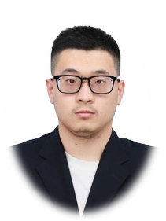

<!-- _coverpage.md -->

# **Qixuan Wang**

> 
PhD candidate, Academy for Advanced Interdisciplinary Studies, Peking University

> 
&emsp; My major is organic synthetic chemistry, specifically in the area of total syntheses of
    natural products. I have taken the courses of organic chemistry, chemical biology, biochemistry, etc. I am also
    interested in computer programming. I have some experience in development of websites, C# WinForm programs and
    python crawlers.

[Contact Me](#contact)
[Get Started](#main)