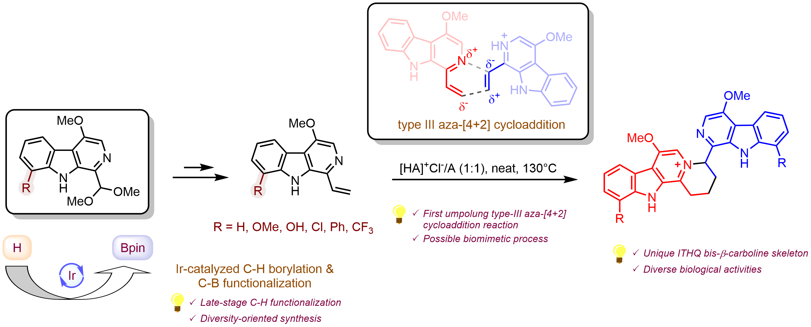
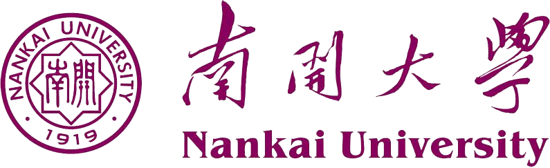

<link rel="stylesheet" href="assets/css/style.css">

# About me

    

        

            
        

        

            

                <h3>Qixuan Wang</h3>
                

                    PhD candidate, Academy for Advanced Interdisciplinary Studies, Peking University
                

                

                    
                    <ul class="fa-ul">
                        <li>
                            <i class="fa fa-envelope fa-lg"></i> Email: 
                        </li>
                        <li>
                            <i class="fab fa-weixin fa-lg"></i> Wechat: 
                        </li>
                        <li>
                            <i class="fa fa-mobile fa-lg"></i> Tel: 
                        </li>
                        <li>
                            <i class="fa fa-earth fa-lg"></i> Website: 
                        </li>
                    </ul>
                

            

        

    

    <em>&emsp; My major is organic synthetic chemistry, specifically in the area of total syntheses of
        natural products. I have taken the courses of organic chemistry, chemical biology, biochemistry, etc. I am also
        interested in computer programming. I have some experience in development of websites, C# WinForm programs and
        python crawlers.</em>

# Publications

    <a href="https://pubs.rsc.org/en/content/articlelanding/2023/sc/d3sc03722c" target="_blank"
       class="pub-title">
        <h3>Divergent total syntheses of ITHQ-type bis-β-carboline alkaloids by
            regio-selective formal aza-[4 + 2] cycloaddition and late-stage C–H functionalization</h3>
    </a>
    
Qixuan Wang#, Fusheng Guo, Jin Wang and Xiaoguang Lei*

    
We herein report
        the first total syntheses of several bis-β-carboline alkaloids, picrasidines G, S, R, and T, and
        natural product-like derivatives in a divergent manner. Picrasidines G, S, and T feature an
        indolotetrahydroquinolizinium (ITHQ) skeleton, while picrasidine R possesses a 1,4-diketone
        linker between two β-carboline fragments. The synthesis of ITHQ-type bis-β-carboline alkaloids
        could be directly achieved by a late-stage regio-selective aza-[4 + 2] cycloaddition of vinyl
        β-carboline alkaloids, suggesting that this remarkable aza-[4 + 2] cycloaddition might be
        involved in the biosynthetic pathway. Computational studies revealed that such aza-[4 + 2]
        cycloaddition is a stepwise process and explained the unique regioselectivity (ΔΔ<em>G</em> =
        3.77 kcal mol<small>−1</small>). Moreover, the successful application of
        iridium-catalyzed C–H borylation on β-carboline substrates enabled the site-selective C-8
        functionalization for efficient synthesis and structural diversification of this family of
        natural products. Finally, concise synthesis of picrasidine R by the thiazolium-catalyzed
        Stetter reaction was also accomplished.
    

    
    

                    
                        Chem. Sci., 2023, <b>14</b>, 10353-10359.
                    
        DOI: <a href="https://pubs.rsc.org/en/content/articlelanding/2023/sc/d3sc03722c">10.1039/d3sc03722c</a>
    

# Education

    

        

            

                <h3 class="mb-0"> Peking University
                </h3>
            

            

                September 2020 - June 2025 (expected)
            

        

        
PhD candidate, Integrative Biology (Chemistry)

        
<b>Supervisor:</b> Prof. Xiaoguang Lei

        
<b>Research Area:</b> total syntheses of natural products.

        
<b>Awards & Certifications:</b>

        <ul class="fa-ul mb-0 ul-awards">
            <li>
                <i class="fas fa-trophy text-warning"></i>
                Freshman Scholarship of Peking University (2020)
            </li>
            <li>
                <i class="fas fa-trophy text-warning"></i>
                <a href="assets/img/2nd%20Prize%20of%20WuXi%20AppTec%20Star%20Future%20Chemistry%20Youth%20Camp%20(2021).jpg"
                   target="_blank">2nd Prize of WuXi AppTec "Star Future" Chemistry Youth Camp
                    (2021)</a>
            </li>
        </ul>
    

    

        

            

                <h3 class="mb-0"> Nankai University
                </h3>
            

            

                September 2016 - June 2020
            

        

        
Bachelor of Science, Chemical Biology

        
<b>Supervisor:</b> Prof. Guangxin Liang

        
<b>Scientific Training:</b> total syntheses of natural products.

        
<b>Averaged Score:</b> 89.12/100, <b>Ranking:</b> 1/20

        
<b>Awards & Certifications:</b>

        <ul class="fa-ul mb-0 ul-awards">
            <li>
                <i class="fas fa-trophy text-warning"></i>
                <a href="assets/img/National%20Scholarship%20(2017).jpg" target="_blank">National
                    Scholarship (2017)</a>
            </li>
            <li>
                <i class="fas fa-trophy text-warning"></i>
                <a href="assets/img/TIANJIN%20JIURI%20NEW%20MATERIALS%20CO.,%20LTD%201st%20Scholarship%20(2018).jpg"
                   target="_blank">TIANJIN JIURI NEW MATERIALS CO., LTD 1st Scholarship
                    (2018)</a>
            </li>
            <li>
                <i class="fas fa-trophy text-warning"></i>
                <a href="assets/img/1st%20Prize%20of%20Chinese%20Mathematics%20Competition%20in%20Tianjin%20Division%20(2018).jpg"
                   target="_blank">1st Prize of Chinese Mathematics Competition in Tianjin Division (2018</a>
                & <a
                    href="assets/img/1st%20Prize%20of%20Chinese%20Mathematics%20Competition%20in%20Tianjin%20Division%20(2019).jpg"
                    target="_blank">2019)</a>
            </li>
            <li>
                <i class="fas fa-trophy text-warning"></i>
                <a href="assets/img/1st%20Prize%20of%20Tianjin%20Undergraduate%20Physics%20Competition%20(2018).jpg"
                   target="_blank">1st Prize of Tianjin Undergraduate Physics Competition (2018)</a>
            </li>
            <li>
                <i class="fas fa-trophy text-warning"></i>
                <a href="assets/img/1st%20Prize%20of%20Chinese%20Undergraduate%20Mathematical%20Contest%20in%20Modeling%20in%20Tianjin%20Division%20(2019).jpg"
                   target="_blank">1st Prize of Chinese Undergraduate Mathematical Contest in
                    Modeling in Tianjin Division (2019)</a>
            </li>
            <li>
                <i class="fas fa-trophy text-warning"></i>
                <a href="javascript:void(0);" target="_blank">Scholarship of Tianjin Municipal People's Government
                    (2020)</a>
            </li>
            <li>
                <i class="fas fa-trophy text-warning"></i>
                <a href="https://mp.weixin.qq.com/s/3UOCi1h8f8twPxSZi2gHGA" target="_blank">Outstanding Graduate of
                    Nankai University</a> (<a
                    href="javascript:void(0);" target="_blank">2020</a>)
            </li>
        </ul>
    

