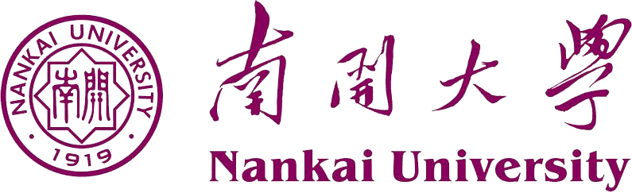

<link rel="stylesheet" href="assets/css/style.css">

# 个人简介

    

        

            
        

        

            

                <h3>王琪璇</h3>
                

                    北京大学前沿交叉学科研究院 博士研究生
                

                

                    
                    <ul class="fa-ul">
                        <li>
                            <i class="fa fa-envelope fa-lg"></i> 邮箱: 
                        </li>
                        <li>
                            <i class="fab fa-weixin fa-lg"></i> 微信: 
                        </li>
                        <li>
                            <i class="fa fa-mobile fa-lg"></i> 电话: 
                        </li>
                        <li>
                            <i class="fa fa-earth fa-lg"></i> 网站: 
                        </li>
                    </ul>
                

            

        

    

    <em>&emsp;我的在读研究方向是有机化学，目前从事天然产物全合成方向的研究工作。我曾修读过有机化学，化学生物学，生物化学等课程。 我对计算机编程也有一定兴趣。我具有一定的网站开发，C#
        WinForm程序开发以及python爬虫程序编写的经验。</em>

# 文章发表

    <a href="https://pubs.rsc.org/en/content/articlelanding/2023/sc/d3sc03722c" target="_blank"
       class="pub-title">
        <h3>通过区域选择性“形式氮杂[4 + 2]环加成”反应以及后期C-H键官能团化策略实现ITHQ型双β咔啉生物碱的发散式合成</h3>
    </a>
    
王琪璇#, 郭富生, 王进 和 雷晓光*

    

        我们在该工作中报道了若干具有双β咔啉结构的生物碱picrasidines G、S、R和T及其若干衍生物的发散式合成。Picrasidines G、S和T具有吲哚并四氢喹嗪阳离子 (ITHQ)骨架结构，而picrasidine
        R是由开链1,4-二酮结构连接两个β咔啉片段。ITHQ型双β咔啉生物碱可由乙烯基取代的单体β咔啉生物碱通过后期区域选择性氮杂[4 + 2]环加成反应形成，这暗示该过程极有可能与生源合成过程密切相关。计算化学研究表明该氮杂[4
        + 2]环加成反应实际上是一个分步过程，并解释了其独特的区域选择性(ΔΔ<em>G</em> = 3.77 kcal mol<small>−1</small>)。此外，我们成功将铱催化的碳氢键硼化方法学应用到β咔啉底物上，实现了β咔啉底物C-8位选择性官能团化，为该类化合物的多样性导向合成以及结构修饰提供了基础。最后，我们利用噻唑盐催化的Stetter反应成功合成了picrasidine
        R。
    

    
    

                    
                        Chem. Sci., 2023, <b>14</b>, 10353-10359.
                    
        DOI: <a href="https://pubs.rsc.org/en/content/articlelanding/2023/sc/d3sc03722c">10.1039/d3sc03722c</a>
    

# 教育经历

    

        

            

                <h3 class="mb-0"> 北京大学
                </h3>
            

            

                2020/09 - 2025/06 (预计)
            

        

        
理学博士研究生在读, 整合生命科学 (化学)

        
<b>导师：</b>雷晓光

        
<b>研究领域：</b>天然产物全合成

        
<b>荣誉和奖励:</b>

        <ul class="fa-ul mb-0 ul-awards">
            <li>
                <i class="fas fa-trophy text-warning"></i>
                北京大学新生奖学金 (2020)
            </li>
            <li>
                <i class="fas fa-trophy text-warning"></i>
                <a href="assets/img/2nd%20Prize%20of%20WuXi%20AppTec%20Star%20Future%20Chemistry%20Youth%20Camp%20(2021).jpg"
                   target="_blank">药明康德“星未来”化学青年营 二等奖 (2021)</a>
            </li>
        </ul>
    

    

        

            

                <h3 class="mb-0"> 南开大学
                </h3>
            

            

                2016/09 - 2020/06
            

        

        
理学学士, 化学生物学

        
<b>导师：</b>梁广鑫

        
<b>研究方向：</b>天然产物全合成

        
<b>学分绩：</b> 89.12/100, <b>专业排名：</b> 1/20

        
<b>荣誉和奖励</b>

        <ul class="fa-ul mb-0 ul-awards">
            <li>
                <i class="fas fa-trophy text-warning"></i>
                <a href="assets/img/National%20Scholarship%20(2017).jpg" target="_blank">国家奖学金 (2017)</a>
            </li>
            <li>
                <i class="fas fa-trophy text-warning"></i>
                <a href="assets/img/TIANJIN%20JIURI%20NEW%20MATERIALS%20CO.,%20LTD%201st%20Scholarship%20(2018).jpg"
                   target="_blank">天津“久日新材”一等奖学金 (2018)</a>
            </li>
            <li>
                <i class="fas fa-trophy text-warning"></i>
                <a href="assets/img/1st%20Prize%20of%20Chinese%20Mathematics%20Competition%20in%20Tianjin%20Division%20(2018).jpg"
                   target="_blank">全国大学生数学竞赛(非数学类) 天津赛区一等奖 (2018</a>
                & <a
                    href="assets/img/1st%20Prize%20of%20Chinese%20Mathematics%20Competition%20in%20Tianjin%20Division%20(2019).jpg"
                    target="_blank">2019)</a>
            </li>
            <li>
                <i class="fas fa-trophy text-warning"></i>
                <a href="assets/img/1st%20Prize%20of%20Tianjin%20Undergraduate%20Physics%20Competition%20(2018).jpg"
                   target="_blank">天津市普通高校大学生物理竞赛 一等奖 (2018)</a>
            </li>
            <li>
                <i class="fas fa-trophy text-warning"></i>
                <a href="assets/img/1st%20Prize%20of%20Chinese%20Undergraduate%20Mathematical%20Contest%20in%20Modeling%20in%20Tianjin%20Division%20(2019).jpg"
                   target="_blank">全国大学生数学建模竞赛 天津赛区一等奖 (2019)</a>
            </li>
            <li>
                <i class="fas fa-trophy text-warning"></i>
                <a href="javascript:void(0);" target="_blank">天津市人民政府奖学金 (2020)</a>
            </li>
            <li>
                <i class="fas fa-trophy text-warning"></i>
                <a href="https://mp.weixin.qq.com/s/3UOCi1h8f8twPxSZi2gHGA" target="_blank">南开大学优秀毕业生</a> (<a
                    href="javascript:void(0);" target="_blank">2020</a>)
            </li>
        </ul>
    

